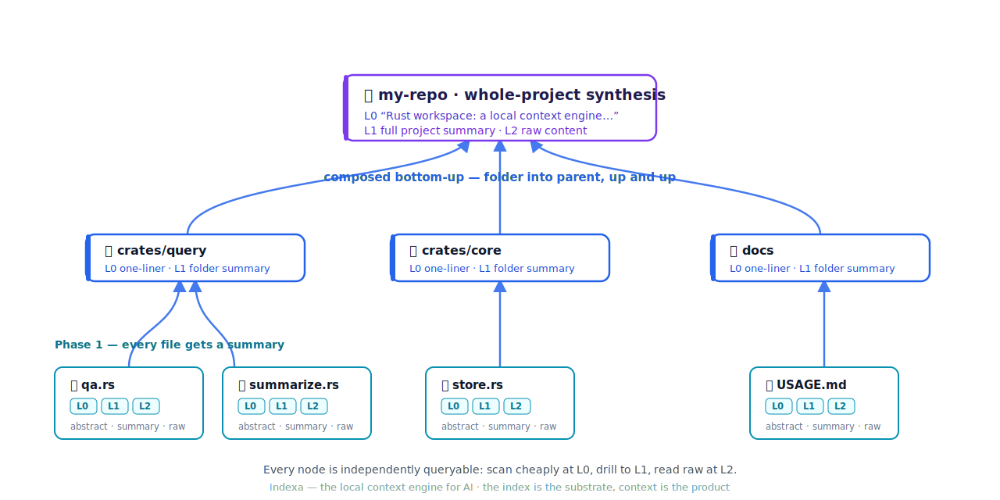
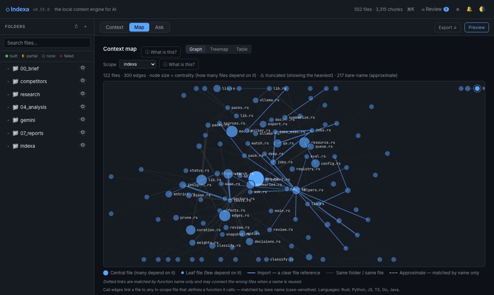

<p align="center">
  
</p>

<p align="center">
  
</p>

**The local context engine for AI.**

Your AI meets your codebase cold on every session — burning paid tokens to relearn what it knew yesterday, or choking on a context window that can't hold your repo at all. Indexa reads your code or your entire disk **once, on your machine**: it writes a summary for **every file**, composes those into a summary for **every folder**, and rolls them up the tree — folder into parent folder, up and up — into one **whole-project synthesis**. Then it serves any AI tool the precise, ranked slice it needs, at any level — a one-line abstract, a full summary, or the raw content — instantly, every time.

```bash
indexa index  ~/code/my-repo            # scan + embed + summarize in one command
indexa ask    "where is auth handled?"  # grounded answer with sources
indexa export ~/code/my-repo --format xml > .context.xml
claude "given @.context.xml, find the auth flow and add MFA"
# the model spends its budget on the work you asked for — not on re-reading your tree
```

*The index is the substrate; context is the product. Local-first · model-agnostic · Apache-2.0.*

> Indexa is production-ready for daily use on one or more repos. Whole-disk indexing is fast; the storage format stabilises before 1.0. New here? Start with the **[Usage Guide](USAGE.md)** or **[Quickstart](docs/quickstart.md)**. Something broken? **[Troubleshooting](docs/TROUBLESHOOTING.md)**.

---

## See it work

Four commands. One context. Every session.

Real output — this is Indexa indexing its own repository (so the numbers are reproducible):

```console
$ cd indexa && indexa index .          # index the repo you just cloned
── Phase 1 / 3 · Scan ──────────────────────────────────────
Scanning .
  552 entries
── Phase 2 / 3 · Deep context ──────────────────────────────
  parsing + embedding …
── Phase 3 / 3 · Summaries ─────────────────────────────────
  summarizing …

✓ Context is ready.
  Ask:    indexa ask "<question>"
  Export: indexa export <path> --format xml > context.xml

$ indexa ask "How does Indexa rank search results?"
Searching 3,315 indexed chunks...

Answer:
Indexa ranks results with a configurable hybrid process — sparse + dense fused
with RRF, an optional cross-encoder reranker, folder-summary blending, and
per-file importance weights. [1]

Sources:
  [1] docs/config.md — Configuration Reference > Retrieval
  [2] crates/query/src/qa/retrieve.rs — retrieve
retrieval coverage: medium — 12 moderate matches

impact: served 508 B vs 27.3 KB of source — 98% less to your AI tool
```

That last line is real and per-answer: Indexa served a ~0.5 KB ranked slice instead of the
27 KB of source files it drew on. The savings pitch below isn't a slogan — every `ask` prints
the figure for *that* answer (and `--json` returns it).

Or open the web workspace (`indexa serve`) — the **Map** lands on an interactive, force-directed knowledge graph of your codebase: each dot is a file, sized by how many other files depend on it; solid lines are confident call edges, dashed lines are approximate name matches (Indexa labels what it isn't sure of). Click a hub to focus it, then expand its neighbors.



Then hand the context to your AI tool — or let your agent pull it live over MCP:

```bash
indexa export ~/code/my-repo --format xml > .context.xml   # the artifact, built on your machine
indexa serve                                               # open the web workspace at :7620
indexa mcp                                                 # expose the live index to any agent
```

---

## How the context builds — every file, rolled up

Indexa builds context in two phases:

**Phase 1 — describe every file.** Each parseable file gets an LLM-written summary: a one-line abstract (**L0**) and a full 1–4 sentence summary (**L1**), with the raw content always one drill-down away (**L2**).

**Phase 2 — roll it up the tree.** Folders are summarised *bottom-up*: each folder's summary is composed from its **children's summaries** — not by re-reading the raw files — folder into parent folder, all the way to a single whole-project synthesis. Every node, file and folder alike, is independently queryable at L0 / L1 / L2.

```text
my-repo/                    ← whole-project synthesis
│   L0  "Rust workspace: a local context engine…"   ·   L1 full summary   ·   L2 raw
│
├── crates/query/           L0 · L1   (folder summary, composed from its files)
│   ├── qa/                 L0 · L1 · L2   (retrieve · synthesize · agentic · …)
│   └── summarize.rs        L0 · L1 · L2
├── crates/core/            L0 · L1
│   └── store.rs            L0 · L1 · L2
└── docs/                   L0 · L1
    └── USAGE.md            L0 · L1 · L2

  Phase 1: every file is summarised   →   Phase 2: folders compose their children, up and up
```

So an agent **scans cheaply** with L0 one-liners, **drills to L1** where a folder looks relevant, and spends tokens on **L2 raw content** only for the few files that actually matter — over CLI, web, or MCP. (That progressive disclosure is what makes the worked example below land at ~94% fewer tokens.) Files Indexa can't extract text from — say, an image without captioning enabled — still take their place in the tree by path and category; their *content* joins the roll-up once captioning or transcription is on.

---

## Why Indexa

**Stop paying to re-teach your AI your own codebase.** Every coding assistant wakes up amnesiac. Before it helps, it reads its way back to orientation — burning context window, paid tokens, and your patience on a lesson it learned five minutes ago. Indexa teaches it *once*: it builds a persistent, hierarchical context store on your machine and serves a small ranked slice on demand, so the model spends its budget on the work you asked for.

> **What that's worth — a worked example** *(illustrative, ~4 chars/token — run `indexa status`
> after a few sessions to see your own measured usage and estimated savings)*: an agent orienting itself in a medium repo
> typically reads ~40 files at ~2,000 tokens each ≈ **80K tokens — every session**. The same
> orientation through Indexa: one `search` (~300 tokens) + ten L0 one-line abstracts (~30 each) +
> the two files it actually needs in full (~4K) ≈ **5K tokens**. That's roughly **94% less**,
> before the session's real work starts — and the index was built locally, for zero tokens.

**There are two kinds of context, and almost everyone conflates them.** *Working context* is what's in the model's window right now — scarce, paid, gone when the session ends. *Searchable context* is everything your AI could know: the store on disk. Indexa separates them. The model never holds your repo; it holds the ~2–4K characters that actually matter, retrieved from a store that can be gigabytes.

**Local isn't the compromise — it's the unlock.** Your data never leaves the machine unless *you* point it at a cloud model, and zero tokens leave while Indexa builds context. A small local model stops being small: feed it a retrieved slice instead of the whole project and a 4K-window model reasons over a 100 MB codebase — fast, even on CPU, with a KV-cache sized by your choice, not your repo. One engine, two wins: it saves cloud tools their tokens **and** gives local models the context they can't hold.

*(How retrieval keeps that slice relevant — hybrid search, the ANN index, the honest trade-offs — is in [docs/methodology.md](docs/methodology.md).)*

---

## The only tool of its kind

**No other tool does this.** Indexa is the first local context engine that builds a persistent, hierarchically-summarised, locally-queryable index over your entire disk — and exposes it simultaneously through a CLI, a live web workspace, a native desktop app, and an MCP server that any AI agent can call in real time.

This is not a repo-to-prompt converter. It is not a document chat app. It is not an IDE extension. It is a persistent, on-device intelligence layer that any AI tool can reach — without re-reading your files, without sending your data to a server, and without starting from zero every session.

**Indexa ends the cold-start problem, permanently.**

---

## What Indexa does

- **One-command context** — `indexa index <path>` scans, embeds, and summarises in a single step. Context is ready immediately; no pipeline to manage.
- **Context that rolls up** — an instant surface scan (zero AI; classifies code vs media vs build artifacts), then deep context: parse → chunk → embed → an LLM summary for **every file**, composed **bottom-up** into a summary for **every folder**, up to one whole-project synthesis — all addressable at **L0 / L1 / L2** (one-line abstract → full summary → raw content). See *[How the context builds](#how-the-context-builds--every-file-rolled-up)* above.
- **Hybrid retrieval** — keyword (BM25) + semantic (vector) fused with RRF, plus an **opt-in ANN index** that keeps dense search fast on 50K-plus-chunk corpora.
- **Local multimodal** *(opt-in, on-device)* — caption images with a local vision model and transcribe audio with a local whisper CLI, so you can find media by what's *in* it, not just its filename.
- **Code intelligence** — a code-relationship graph (imports + defined symbols + call edges) across Rust, Python, JS/TS, Go, and Java, plus `who_calls`, `blast_radius`, and an interactive **call-graph visualization** in the web Map tab — all queryable over MCP.
- **Four ways to reach the index** — a CLI, a live web workspace with an Engine status bar, a native macOS desktop app (menu-bar, auto-updating), and an MCP server (46 tools) that AI agents call directly.
- **Resource-aware** — a memory watchdog that won't freeze your machine, and a hardware-aware model picker that annotates every model with its memory footprint, fit against your live RAM, and a per-job ETA.
- **Use your Claude subscription** — the `claude-code` provider runs summaries and answers on your Claude Pro/Max plan (no per-token billing); embeddings always stay local.
- **Export** — XML (the format Anthropic's own docs recommend for context windows), Markdown, or JSON. **Watch** keeps the context current as files change.

---

## Four ways to use it

- **CLI** — `index · ask · export · scan · deep · summarize · watch · serve · mcp · doctor · classify · completion · update`. Scriptable, pipeable, zero services required (`indexa completion <shell>` emits tab-completions).
- **Web workspace** — `indexa serve` → `http://localhost:7620`. Responsive (collapses to a drawer on a phone), keyboard-navigable, and honest about impact — a **token-savings panel** shows what retrieval saved your AI tools this week. A live Engine status bar shows what the machine is doing while it builds:
  ```
  Engine  Building · 42 files/s · ETA 1m12s · gemma3:4b    CPU 38%   RAM 9.1 / 16 GB   pressure: ok
  ```
- **Desktop app** — a native macOS app that lives in the menu bar. Auto-updates silently. Bundles the web workspace — no separate `indexa serve` needed.
- **MCP server** — `indexa mcp` exposes the live index to any [MCP](https://modelcontextprotocol.io) client (Claude Desktop, Cursor, Claude Code) over **46 tools** — retrieval (`search · browse_tree · get_summary · read_file · get_chunk_context · ask`, with multi-turn `session_id`), project overview + retrieval trace + path inspection, code graph (`dependencies · who_imports · who_calls · blast_radius · code_graph`), Context Packs, importance weights, smart classification, insights, decision review, config introspection, and indexing triggers — plus **4 read-only resources** (`indexa://overview · packs · pack/{name} · summary/{path}`) and **3 prompt templates** (`onboarding-overview · explain-file · pack-context`).
- **Conversational Ask** — pass a `session_id` (CLI `--session-id`/`--continue`, web chat thread, MCP `ask`) and follow-ups remember the conversation: prior turns are folded into the prompt and the follow-up is rewritten into a standalone retrieval query.

---

## Code intelligence

Deep-indexing records each code file's graph edges — what it **imports**, the symbols it **defines**, and what it **calls** — across Rust, Python, JS/TS, Go, and Java. Query it over MCP, so your agent reasons about structure without reading every file:

```text
dependencies("src/auth/session.rs")
  → imports:  crate::store::Db
  → defines:  Session, mint_token, validate

who_imports("crate::store::Db")
  → src/auth/session.rs

blast_radius("mint_token")
  → src/auth/session.rs, src/auth/login.rs, src/auth/middleware.rs
```

Or **see** the whole call graph: `indexa graph <dir>` on the CLI, or the **Graph** sub-view in the
web Map tab — an interactive force-directed view of which files call into which.

---

## Install

Download a pre-built binary from [Releases](../../releases):

```bash
# macOS (Apple Silicon)
curl -L -o /usr/local/bin/indexa \
  https://github.com/harf-promo/indexa/releases/latest/download/indexa-aarch64-apple-darwin
chmod +x /usr/local/bin/indexa
xattr -d com.apple.quarantine /usr/local/bin/indexa   # bypass Gatekeeper if prompted

# macOS (Intel): indexa-x86_64-apple-darwin
# Linux x86_64:  indexa-x86_64-linux-gnu      ·  Linux arm64: indexa-aarch64-linux-gnu
# Windows x64:   indexa-x86_64-windows.exe
```

Indexa runs on local models (one-time download, ~11 GB total; everything runs offline after this).
The first time you `index`, Indexa **detects the missing models and offers to pull them for you** with a
live progress bar — just say yes. To check your setup first, or pull manually:

```bash
indexa doctor                  # checks Ollama + which models are present, with fix-it hints

# (optional) pull manually instead of the first-run prompt:
ollama pull nomic-embed-text   # embeddings (~270 MB)
ollama pull gemma3:4b          # file summaries (~2.5 GB)
ollama pull gemma3:12b         # answers + directory roll-ups (~8 GB)
```

Or build from source (Rust ≥ 1.82): `git clone … && cargo build --release` → `target/release/indexa`.

---

## Bring your own model

No model is bundled — Indexa works with whatever you run. Configure in `~/.indexa/config.toml`:

| Adapter | How it runs |
|---|---|
| **Ollama** | Local, fully offline (default). Point elsewhere with `OLLAMA_HOST`. |
| **Claude subscription** | `provider = "claude-code"` — synthesis on your Claude Pro/Max plan, no per-token billing. Embeddings stay local. |
| **llama.cpp** | Local via its HTTP server. |
| **Google Gemini · OpenAI · Anthropic** | Cloud — data leaves your device; API key required. |

Defaults: `nomic-embed-text` (embeddings) · `gemma3:4b` (file context) · `gemma3:12b` (answers + roll-ups). Optional cross-encoder reranking *fails open* — a model hiccup falls back to the original order, so it can never make `ask` worse.

---

## What's coming

- **Mobile companion** — browse your index from a phone on the same network. The read-only API is already LAN-ready (`indexa serve --host 0.0.0.0`); a native client is next.
- **Plugin marketplace** — the parser SDK is shipped (`indexa_parsers::Registry`); next is discovery and distribution of third-party parsers.

Recently shipped: **agentic `ask`** (multi-hop plan→search→refine), **PageRank centrality** (hub files in the code graph), **signature graph visualization**, **universal macOS desktop build**, **Importance weighting**, **Insights** (duplicates / stale / weekly diff), **video captioning**, **Plugin SDK**, **LAN serve**.

Ideas and votes in [Discussions](../../discussions/categories/ideas). Full detail in [ROADMAP.md](ROADMAP.md).

---

## Contributing

Indexa is built in the open and welcomes contributors of every level. Read [CONTRIBUTING.md](CONTRIBUTING.md), browse [`good first issue`](../../issues?q=label%3A%22good+first+issue%22), and join [Discussions](../../discussions). Commits sign off with the [DCO](https://developercertificate.org/) (`git commit -s`); no CLA.

## License

Apache License 2.0 — see [LICENSE](LICENSE). Copyright 2025 Harf Promo.
